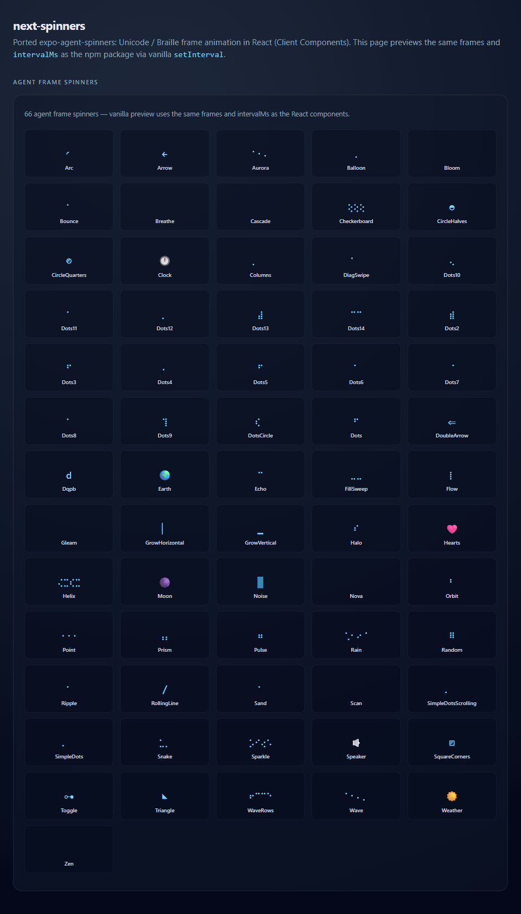

# next-spinners

**55** Braille / ASCII / emoji **frame spinners** for **Next.js** and **React**, ported from [`Eronred/expo-agent-spinners`](https://github.com/Eronred/expo-agent-spinners). Same Unicode frames and `setInterval` timings as the Expo app; **inline styles only** (no CSS import).

## Preview



The GIF is a vanilla preview of the full spinner grid (same frames and `intervalMs` as the React components). On **npmjs.com**, if the image does not render, use a versioned URL such as  
`https://unpkg.com/next-spinners@0.2.0/media/next-spinners-overview.gif` (adjust the version after release).

## Install

```bash
npm install next-spinners
```

Requires **Node 22+**.

## Usage (Client Components)

Every export from this package uses **`"use client"`** (React state + `setInterval`). Import spinners only from **Client Components**, or from modules marked with `"use client"`:

```tsx
"use client";

import { DotsSpinner, WaveSpinner, PulseSpinner } from "next-spinners";

export function LoadingRow() {
  return (
    <p style={{ display: "flex", alignItems: "center", gap: "0.75rem" }}>
      <DotsSpinner size={24} color="#38bdf8" label="Loading dashboard" />
      <span>Loading dashboard…</span>
    </p>
  );
}
```

You can render a client spinner as a child of a Server Component by wrapping it in a small client file—standard Next.js App Router pattern. **Do not** import `next-spinners/next-spinner.css`; it is not part of this package.

### Props (all ported spinners)

| Prop    | Type              | Default     | Notes                                         |
| ------- | ----------------- | ----------- | --------------------------------------------- |
| `size`  | `number`          | `24`        | Maps to `fontSize` (px).                      |
| `color` | `string`          | `"#fff"`    | CSS color.                                    |
| `style` | `CSSProperties`   | —           | Merged after base styles.                     |
| `label` | `string`          | `"Loading"` | `aria-label` on the `status` live region.     |
| …       | `HTMLSpanElement` | —           | Standard span attributes (`className`, etc.). |

### Factory

To build your own frame spinner (Client Component):

```tsx
"use client";

import { createAgentFrameSpinner } from "next-spinners";

const FRAMES = ["⠋", "⠙", "⠹"] as const;
export const MySpinner = createAgentFrameSpinner(FRAMES, 80, "MySpinner");
```

### Public API

- `createAgentFrameSpinner`, type `AgentFrameSpinnerProps`
- All `*Spinner` exports from `src/spinners/` (re-exported from the package root)

### Expo demo name → export (55)

Names on the left are the keys used in the upstream demo app; the right column is the **named export** from `next-spinners`.

| Expo (demo)             | Export                       |
| ----------------------- | ---------------------------- |
| `dots`                  | `DotsSpinner`                |
| `dots2`                 | `Dots2Spinner`               |
| `dots3`                 | `Dots3Spinner`               |
| `dots4`                 | `Dots4Spinner`               |
| `dots5`                 | `Dots5Spinner`               |
| `dots6`                 | `Dots6Spinner`               |
| `dots7`                 | `Dots7Spinner`               |
| `dots8`                 | `Dots8Spinner`               |
| `dots9`                 | `Dots9Spinner`               |
| `dots10`                | `Dots10Spinner`              |
| `dots11`                | `Dots11Spinner`              |
| `dots12`                | `Dots12Spinner`              |
| `dots13`                | `Dots13Spinner`              |
| `dots14`                | `Dots14Spinner`              |
| `sand`                  | `SandSpinner`                |
| `bounce`                | `BounceSpinner`              |
| `dots_circle`           | `DotsCircleSpinner`          |
| `wave`                  | `WaveSpinner`                |
| `scan`                  | `ScanSpinner`                |
| `rain`                  | `RainSpinner`                |
| `pulse`                 | `PulseSpinner`               |
| `snake`                 | `SnakeSpinner`               |
| `sparkle`               | `SparkleSpinner`             |
| `cascade`               | `CascadeSpinner`             |
| `columns`               | `ColumnsSpinner`             |
| `orbit`                 | `OrbitSpinner`               |
| `breathe`               | `BreatheSpinner`             |
| `waverows`              | `WaveRowsSpinner`            |
| `checkerboard`          | `CheckerboardSpinner`        |
| `helix`                 | `HelixSpinner`               |
| `fillsweep`             | `FillSweepSpinner`           |
| `diagswipe`             | `DiagSwipeSpinner`           |
| `dqpb`                  | `DqpbSpinner`                |
| `rolling_line`          | `RollingLineSpinner`         |
| `simple_dots`           | `SimpleDotsSpinner`          |
| `simple_dots_scrolling` | `SimpleDotsScrollingSpinner` |
| `arc`                   | `ArcSpinner`                 |
| `balloon`               | `BalloonSpinner`             |
| `circle_halves`         | `CircleHalvesSpinner`        |
| `circle_quarters`       | `CircleQuartersSpinner`      |
| `point`                 | `PointSpinner`               |
| `square_corners`        | `SquareCornersSpinner`       |
| `toggle`                | `ToggleSpinner`              |
| `triangle`              | `TriangleSpinner`            |
| `grow_horizontal`       | `GrowHorizontalSpinner`      |
| `grow_vertical`         | `GrowVerticalSpinner`        |
| `noise`                 | `NoiseSpinner`               |
| `arrow`                 | `ArrowSpinner`               |
| `double_arrow`          | `DoubleArrowSpinner`         |
| `hearts`                | `HeartsSpinner`              |
| `clock`                 | `ClockSpinner`               |
| `earth`                 | `EarthSpinner`               |
| `moon`                  | `MoonSpinner`                |
| `speaker`               | `SpeakerSpinner`             |
| `weather`               | `WeatherSpinner`             |

## App Router example

See [`examples/ExampleAppRouterPage.tsx`](./examples/ExampleAppRouterPage.tsx) and [`examples/README.md`](./examples/README.md).

## Maintainers: regenerating spinner modules

1. Clone [expo-agent-spinners](https://github.com/Eronred/expo-agent-spinners) into `.expo-spinners-src/` at the repo root (folder is gitignored).
2. Run `node scripts/generate-agent-spinners.mjs`.
3. Format, test, and build.

## License

MIT
