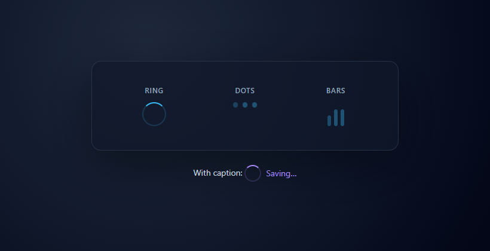

# next-spinner-kit

Small, accessible loading indicators for **Next.js** and **React**. Components are **Server Component friendly** (no `"use client"` required). Styles ship as a separate CSS file you import once.

## Preview



The GIF is shipped in the npm package under `media/` so this relative path works on GitHub. On **npmjs.com**, if the image does not render, use the versioned file URL instead, for example:  
`https://unpkg.com/next-spinner-kit@0.1.0/media/next-spinner-kit-overview.gif` (bump the version after each release).

## Install

```bash
npm install next-spinner-kit
```

Requires **Node 22+** (matches [Shiphook](https://github.com/cap-jmk-real/shiphook) and modern Next.js toolchains).

## Usage (App Router)

Import the stylesheet once in your root layout:

```tsx
// app/layout.tsx
import "next-spinner-kit/next-spinner.css";
```

Use the spinner anywhere (Server or Client Components):

```tsx
import { NextSpinner } from "next-spinner-kit";

export default function Page() {
  return (
    <p>
      <NextSpinner variant="ring" size="md" label="Loading dashboard" />
    </p>
  );
}
```

### Variants and sizes

- **variant**: `"ring"` (default) | `"dots"` | `"bars"`
- **size**: `"sm"` | `"md"` (default) | `"lg"`

### Theming

Override the accent color with CSS on a wrapper or globally:

```css
.my-panel .nsk {
  --nsk-color: #10b981;
}
```

### Caption

Pass children to show text beside the indicator:

```tsx
<NextSpinner label="Loading">Fetching data…</NextSpinner>
```

## Full page example

See [`examples/ExampleAppRouterPage.tsx`](./examples/ExampleAppRouterPage.tsx) for a ready-to-copy App Router page that exercises all variants.

## Coverage

CI enforces **≥ 80%** statements/branches/functions/lines on `src/` (see `vitest.config.ts`). Run locally:

```bash
npm run test:coverage
```

## Regenerate the preview GIF (maintainers)

Requires [ffmpeg](https://ffmpeg.org/) on your `PATH` and a Playwright browser (Chrome/Edge works via channel detection, otherwise install Chromium):

```bash
npx playwright install chromium
npm run media:gif
```

This writes `media/next-spinner-kit-overview.gif`.

## Publish to npm

```bash
npm login
npm publish --access public
```

`prepublishOnly` runs the same checks as `npm run ci` plus `npm run build`, so only publish from a clean tree after tests pass.

## Deploying with Shiphook

This repo includes a [`shiphook.yaml`](./shiphook.yaml) that runs a clean install, full CI, and build after `git pull` on your server. See [Shiphook](https://github.com/cap-jmk-real/shiphook) for setup (webhook secret, HTTPS, `runScript`).

## Development

```bash
npm ci
npm run ci
npm run build
```

## License

MIT
